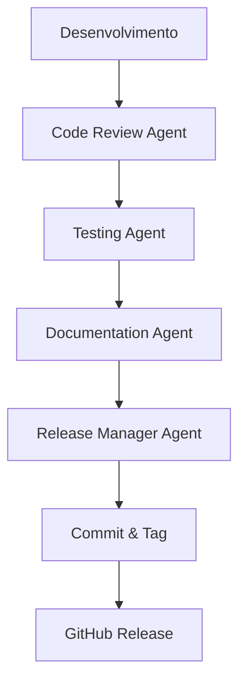

# 📁 .github - Configuração e Automação

Esta pasta contém configurações e guias para automação do projeto.

---

## 📄 Arquivos

### RELEASE_GUIDE.md
Guia completo para criação de releases, incluindo:
- Passos para criar release no GitHub
- Documentação de Semantic Versioning
- Convenções de Conventional Commits
- Checklist de release
- Workflow de versionamento
- Roadmap de versões

### copilot-instructions.md
Instruções específicas para GitHub Copilot sobre:
- Tipo de projeto (Next.js 15)
- Estrutura de pastas
- Progresso do desenvolvimento
- Convenções de código

---

## 🤖 Usando os Agentes

### Release Manager Agent

Para preparar uma nova release, use o prompt do **Release Manager Agent** (documentado em `/AGENTS.md`):

```
Você é o Release Manager Agent. Prepare a release v1.2.0 incluindo:

Features:
- Nova funcionalidade X
- Nova funcionalidade Y

Fixes:
- Correção de bug Z

Siga todas as etapas documentadas em AGENTS.md.
```

O agente irá:
1. ✅ Analisar todos os commits
2. ✅ Determinar tipo de versão (MAJOR.MINOR.PATCH)
3. ✅ Atualizar todos os arquivos .md
4. ✅ Sincronizar arquivos .mdx
5. ✅ Criar RELEASE_NOTES_vX.Y.Z.md
6. ✅ Atualizar package.json
7. ✅ Criar commit e tag
8. ✅ Fornecer instruções para GitHub

### Outros Agentes

Consulte `/AGENTS.md` para documentação completa sobre:
- Documentation Agent
- Testing Agent
- Code Review Agent

---

## 🔄 Workflow de Release



---

## 📚 Recursos Relacionados

- **[/AGENTS.md](../AGENTS.md)** - Documentação completa dos agentes
- **[/CLAUDE.md](../CLAUDE.md)** - Contexto completo do projeto para IA
- **[/CHANGELOG.md](../CHANGELOG.md)** - Histórico de versões
- **[/RELEASE_NOTES_*.md](../)** - Release notes de cada versão

---

## 🎯 Próximos Passos

### Automação Futura

- [ ] GitHub Actions para CI/CD
- [ ] Automação de testes
- [ ] Deploy automático
- [ ] Geração automática de changelog
- [ ] Bot para release notes

### Templates GitHub

- [ ] Issue templates
- [ ] Pull request template
- [ ] Bug report template
- [ ] Feature request template

---

**Última Atualização**: 05/11/2025
