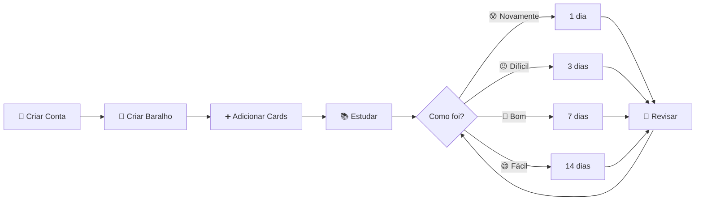
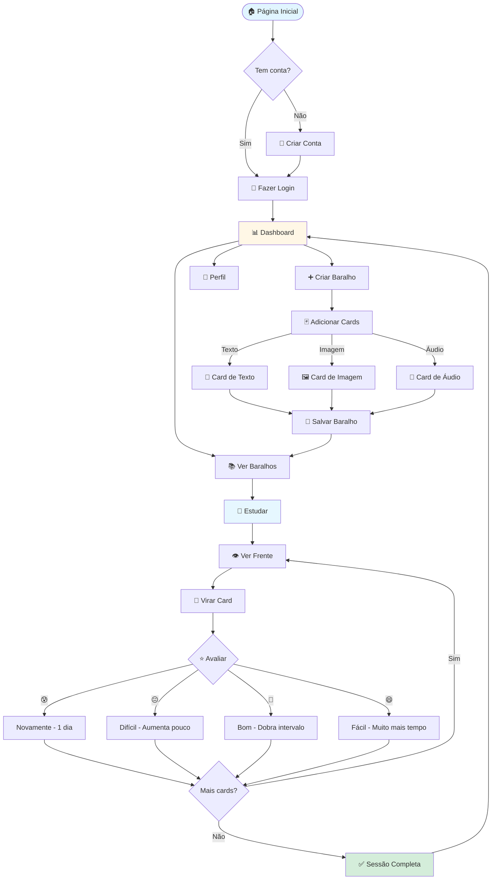
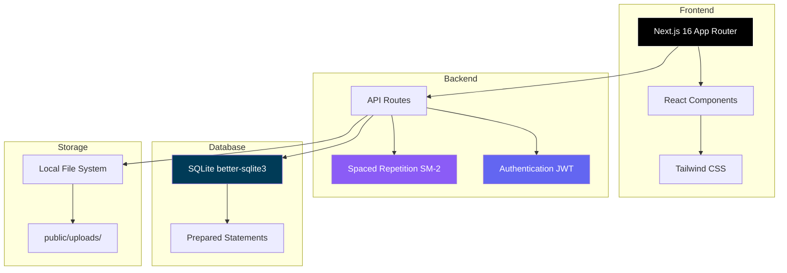

<div align="center">

# 🎴 MVP Estetoscópio

### Sistema de Flashcards com Repetição Espaçada

Plataforma moderna de estudos inspirada no Anki, construída com Next.js 16, TypeScript e SQLite. Crie baralhos personalizados com texto, imagens e áudio, e estude de forma inteligente com algoritmo SM-2.

[](https://nextjs.org/)
[](https://www.typescriptlang.org/)
[](https://tailwindcss.com/)
[](LICENSE)

[✨ Demo](#-demonstração) • [📚 Documentação](https://github.com/bernardopg/mvp-estetoscopio/wiki) • [🚀 Início Rápido](#-início-rápido) • [🤝 Contribuir](CONTRIBUTING.md)

</div>

---

## 📖 Sobre o Projeto

O **MVP Estetoscópio** é uma plataforma web para estudos baseada em flashcards que utiliza o **algoritmo de repetição espaçada SM-2** para otimizar a retenção de conhecimento. O sistema calcula automaticamente os melhores intervalos para revisar cada card, maximizando o aprendizado com o mínimo de tempo.

### 💡 Por que usar repetição espaçada?

A repetição espaçada é uma técnica de aprendizado baseada em revisar informações em intervalos crescentes de tempo. Estudos mostram que essa técnica pode aumentar a retenção de longo prazo em até **200%** comparado a métodos tradicionais de estudo.

### ✨ Principais Funcionalidades

<table>
<tr>
<td width="33%">

#### 🎴 Flashcards Multimídia
- Texto com suporte Markdown
- Imagens (JPEG, PNG, GIF)
- Áudio (MP3, WAV, OGG)
- Animação 3D de flip

</td>
<td width="33%">

#### 🧠 Repetição Espaçada
- Algoritmo SM-2
- Cálculo automático de intervalos
- 4 níveis de dificuldade
- Tracking de progresso

</td>
<td width="33%">

#### 📊 Organização
- Sistema de pastas
- Tags personalizadas
- Cores e ícones
- Favoritos

</td>
</tr>
</table>

---

## 🎯 Como Funciona



### Fluxo do Usuário



---

## 🚀 Início Rápido

### Pré-requisitos

- **Node.js** 18+
- **npm**, yarn ou pnpm

### Instalação

```bash
# 1. Clone o repositório
git clone https://github.com/bernardopg/mvp-estetoscopio.git
cd mvp-estetoscopio

# 2. Instale as dependências
npm install

# 3. Inicie o servidor de desenvolvimento
npm run dev
```

Acesse [http://localhost:3000](http://localhost:3000) 🎉

### Primeiros Passos

1. 📝 Crie sua conta em `/signup`
2. 🔐 Faça login em `/login`
3. ➕ Crie seu primeiro baralho
4. 📚 Comece a estudar!

---

## 🎨 Demonstração

> **Nota**: Screenshots serão adicionados em breve em `.github/assets/screenshots/`

### Interface Principal

<!--
Adicionar screenshots aqui:
- Dashboard com estatísticas
- Interface de criação de baralho
- Modo de estudo
- Sistema de pastas e tags
-->

### Arquitetura do Sistema



---

## 🛠️ Stack Tecnológica

<table>
<tr>
<td align="center" width="25%">

<br><strong>Next.js 16</strong>
<br><sub>Framework React</sub>
</td>
<td align="center" width="25%">

<br><strong>TypeScript 5</strong>
<br><sub>Type Safety</sub>
</td>
<td align="center" width="25%">

<br><strong>Tailwind CSS 4</strong>
<br><sub>Styling</sub>
</td>
<td align="center" width="25%">

<br><strong>SQLite</strong>
<br><sub>Database</sub>
</td>
</tr>
</table>

**Detalhes completos**: Veja a [arquitetura técnica na Wiki](https://github.com/bernardopg/mvp-estetoscopio/wiki/Arquitetura)

---

## 📚 Documentação

Toda a documentação detalhada está disponível na **[Wiki do Projeto](https://github.com/bernardopg/mvp-estetoscopio/wiki)**:

### 📖 Para Usuários

- **[Guia de Início](docs/user/getting-started.md)** - Primeiros passos
- **[Guia do Usuário](docs/user/user-guide.md)** - Manual completo
- **[Exemplos](docs/user/examples.md)** - Casos de uso práticos
- **[FAQ](docs/user/faq.md)** - Perguntas frequentes

### 💻 Para Desenvolvedores

- **[Arquitetura](docs/developer/architecture.md)** - Visão técnica do sistema
- **[API Reference](docs/developer/api-reference.md)** - Documentação completa da API
- **[Contribuindo](CONTRIBUTING.md)** - Como contribuir
- **[Migrações](docs/developer/migrations.md)** - Database migrations

### 🔧 Para Mantenedores

- **[Agentes AI](docs/maintainer/agents.md)** - Documentação dos agentes
- **[Release Guide](docs/maintainer/release-guide.md)** - Processo de release
- **[Claude Context](docs/maintainer/claude-context.md)** - Contexto para IA

---

## 🗺️ Roadmap

### v1.2 (Em Desenvolvimento)

- [ ] PWA (Progressive Web App) para uso offline
- [ ] Estatísticas avançadas com gráficos
- [ ] Export/Import de baralhos (JSON, CSV, Anki)
- [ ] Sistema de compartilhamento de baralhos

### v2.0 (Futuro)

- [ ] App mobile nativo (React Native)
- [ ] Sincronização multi-dispositivo
- [ ] Sistema de conquistas e gamificação
- [ ] Suporte a LaTeX para fórmulas matemáticas
- [ ] Editor WYSIWYG para cards

**Veja o roadmap completo**: [CHANGELOG.md](CHANGELOG.md)

---

## 🤝 Contribuindo

Contribuições são bem-vindas!

1. Fork o projeto
2. Crie uma branch (`git checkout -b feature/MinhaFeature`)
3. Commit suas mudanças (`git commit -m 'feat: adicionar MinhaFeature'`)
4. Push para a branch (`git push origin feature/MinhaFeature`)
5. Abra um Pull Request

**Leia o guia completo**: [CONTRIBUTING.md](CONTRIBUTING.md)

### 🐛 Reportar Bugs

[Abra uma issue](https://github.com/bernardopg/mvp-estetoscopio/issues/new?template=bug_report.md) usando o template de bug report.

### ✨ Sugerir Features

[Abra uma issue](https://github.com/bernardopg/mvp-estetoscopio/issues/new?template=feature_request.md) usando o template de feature request.

---

## 📄 Licença

Este projeto está licenciado sob a [Licença MIT](LICENSE) - veja o arquivo LICENSE para detalhes.

---

## 🙏 Agradecimentos

- Inspirado no [Anki](https://apps.ankiweb.net/)
- Algoritmo SM-2 por [Piotr Wozniak](https://www.supermemo.com/)
- Comunidade open source

---

## 📞 Contato

**Bernardo Gomes**

- 📧 Email: bernardo.gomes@bebitterbebetter.com.br
- 🐙 GitHub: [@bernardopg](https://github.com/bernardopg)
- 📷 Instagram: [@be.pgomes](https://instagram.com/be.pgomes)

---

<div align="center">

**[⬆ Voltar ao topo](#-mvp-estetoscópio)**

Desenvolvido com ❤️ e ☕ por [Bernardo Gomes](https://github.com/bernardopg)

**⭐ Se este projeto te ajudou, considere dar uma estrela!**

[](https://github.com/bernardopg/mvp-estetoscopio/stargazers)
[](https://github.com/bernardopg/mvp-estetoscopio/network/members)

</div>
